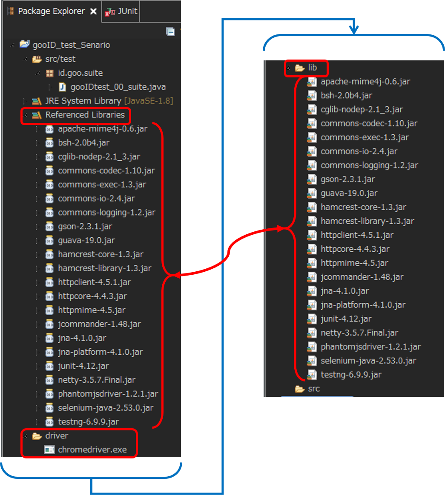

<div name="Header" style="border-left:20px groove #0059ab; padding-left:20px; line-height:1.1">
<b>
	<font size="7em">Selenium Know How Sheet</font><br>
	<font size="3em" color="#555555">
	Last Update: 2016/08/01 , Author: d-hisa
	</font>
</b>
</div>

## Selenium全体についてのTips
### Seleniumでメール確認をするTips
Refをまとめると、
- gmailの裏ワザを使うと無限にメアドが錬成できる
	+ ホスト名に＋を含めると、＋～＠間が無視される
	+ ＠以前のドットは無視される
		* example@gmail.com
		* example+hogehoge@gmail.com
		* e.x.a.m.p.l.e@gmail.com  
	は全部同じアドレスで受信できる
- クエリに`?ui=html&zy=e`をつけるとgmailをhtmlモードで見れるのでセレクタが使える
	+ ただし、現在では一度確認のアナウンスが出るため適宜処理が必要
	+ あとページ開くときにlogout用URLを叩く必要あり
		* しかも現状だと普通に叩けば前にログインしたアカウントがそのまま出ちゃうので、キャッシュ消す・シークレットウィンドウで出す、分岐処理するなどの対策が必要
	+ あといつまで使えるかは不明

#### Reference
- [Selenium WebDriverで、新規会員登録フローのE2Eブラウザテストを自動化してみた。 - ハウテレビジョン開発者ブログ](http://blog.howtelevision.co.jp/entry/2015/12/09/144412)
- [Seleniumで、メール受信のテストをする方法 - Qiita](http://qiita.com/DQNEO/items/0927e090d4bc92a9c44e)

## Selenium WebDriver for Eclipse
### Environment
- Eclipse
- JUnit
- Selenium WebDriver

### Instalation
#### Need elements

+ Eclipse
+ selenium Lib (selenium-java-\*\*.\*\*.\*\*.zip)
+ BrowserDriver (without Firefox)  
各Driverは[ここ](http://www.seleniumhq.org/download/)のリンクからがんばって探すこと

#### Flow
1. ##### [Eclipse]  
New java project create (Named "**WDT**")
1. ##### [Explorer / Eclipse]  
WDT直下に**lib**フォルダを生成
1. ##### [Explorer / Eclipse]  
selenium Libの中身のうち、  
	+ libsフォルダ内のjarすべて
	+ selenium-java-\*\*.\*\*.\*\*.jar
をWDT/libへコピー
1. ##### [Eclipce]  
WDTプロジェクトを右クリック->[Properties]->[Java Build Path]->[Libraries]->[Add JARS...]で <br> WDT/lib以下の工程3でコピーしたjarをすべて選択
1. ##### [Eclipce]  
既存srcフォルダを削除し（理由は不明）、WDTプロジェクトを右クリック->[New]->[Source Folder]で新たなパッケージフォルダをWDT直下に作成。<br>今回は**src/test**
1. ##### [Eclipce]  
パッケージフォルダ内に新たなパッケージを作成<br>[Right Click - src/test]->[New]->[Package]<br>今回は**id.goo.suite**
1. ##### [Explorer / Eclipse]  
WDT直下に**driver**フォルダを生成し、任意のdriver.exeを入れる
1. ##### [Eclipce]  
id.goo.suiteに[New]->[File]でファイルを作成（末尾に.javaを忘れないように）

##### Result Configuration



### Development
#### Method
##### Page open
```java
driver.get("PAGE_URL");
```
##### Cache delete
```java
driver.manage().deleteAllCookies();
```
##### Change Frame
```java
driver.switchTo().frame("FRAME_NAME_OR_ID");
```
`frameset`されているとき、frameを変更できる
###### NOTICE
一度切替を置こうなうと、別のFrameへ切り替えるときにはTopへ一度戻さなければならないことに注意
```java
driver.switchTo().defaultContent();
driver.switchTo().frame("Another_frame");
```


#### Error fix
##### unable to connect to host 127.0.0.1 on port 7055 after 45000 ms. firefox console output
firefoxに接続できない旨のエラー。  
firefoxのバージョンにSeleniumが対応していないことが要因。  

+ Seleniumのバージョンアップ
+ Firefoxのダウングレード

のどちらかが必要。  
今回（2016/08/02時点）はseleniumの最新ver.が3.0.0-betaだったため、Firefoxのダウングレードを実施。ダウングレードは最新版をアンインストールして古いバージョンを探してきて入れる。

+ firefox : 46.0(2016/04 release)
+ Selenium: 2.53(2016/05 release)

次いで、Firefoxの自動アップデートを切っておく。  
[*ハンバーガーメニュー*]->[オプション]->[詳細]->[更新]  
で[*更新の確認は行うが、インストールするかどうかを選択する*]を選択。

> **Reference**  
[Selenium WebDriver　"Unable to connect to host" エラー - Qiita](http://qiita.com/Sankame/items/ac347a83f45f7fddf7cb)  
[kakakikikekeのブログ: Failed to connect to binary FirefoxBinary](http://kakakikikeke.blogspot.jp/2014/09/failed-to-connect-to-binary.html)

##### InitializationError
**Notice** の [extends問題](#notice-extends) を参照のこと。

#### Notice
##### JUnitの実行問題
projectごとRun as JUnitすると、TestSuiteで＠Testが実行されたあと、各Classの＠Testも実行されちゃう謎仕様なので、TestSuiteClass単体をRunする必要あり。  
要fix？
##### <a name="notice-extends"> extends問題
###### 問題
TestBase的なClassを各TestCase.Classがextendsする仕様にして、Driverを共有化しているが、このTestBase.ClassをTestSuite化すると、（おそらく）循環参照的なノリでInitializationErrorを吐く。
###### 対策
TestSuiteを別に作り(Alltests.Class)、AllTestsの＠BeforeClassからTestBaseの初期化関数を参照するようにすると通る。このときAllTestsもTestBaseをextendsしておくこと。

#### Reference
[PageObjectデザインパターンを利用して画面変更に強いUIテストを作成する](http://softwaretest.jp/labo/tech/labo-292/)
[Selenium WebDriverでWebアプリのテストが変わる（後編）：Selenium WebDriverのブラウザ自動テストを実践する (1/2) - ＠IT](http://www.atmarkit.co.jp/ait/articles/1211/07/news009.html)

## JUnit
### summary
javaのユニットテストツール  
### Anotation
JUnitではアノテーションと呼ばれる注釈付けによってテスト実行時の挙動を制御する。
#### @Test
実際のテスト項目がここに入る。  
#### @Before / @After
@Testが実行される前（後）に呼び出される。  
**staticでなければならない。**  
それぞれのテスト間の影響を抑えるため、テストが少ない場合はここで各テスト用のDriverを宣言する（終了処理をする）と良い。  
>#### テストが多い場合
すべてのテストクラスの共通継承親クラスをつくり、そこでDriverを定義すると良い。  
ただし、Cookieやブラウザキャッシュなどに注意すること。  
各情報を消す、あるいはDriverインスタンスの再生成が必要。

#### @BeforeClass / @AfterClass
テストクラス全体が実行される前（後）に呼び出される。  
**staticではいけない。**

## Selenium Server
インターネットオプションでproxyの例外設定をする必要アリ。   
`localhost,127.0.0.1`を例外に追加。

## WebDriver以外のSelenium
### Selenium IDE
### Selenium Builder
### Selenium Grid
専用のサーバ（Selenium Grid Sever）をHubとして様々な実機に対して同じテストスクリプトを実施できる仕組み。  
記述自体はWebDriverがメイン。  
イメージとしては  
```bash
[Client PC(have test script)]
└[Selenium Grid Server]
  ├[Node:Machine 1(ex. Windows)]
  │├Browser 1(ex. Edge)
  │└Browser 2(ex. Chrome)
  ├[Node:Machine 2(ex.iOS)]
  │├Browser 1(ex. firefox)
  │├Browser 2(ex. safari)
  ...
```
南砂にも共用環境があるので一読  
[共通Selenium環境利用マニュアル - 南砂クラウド 利用者向けWiki - meTicket](https://ticket.pf.goo.ne.jp/redmine/projects/for_user_wiki/wiki/%E5%85%B1%E9%80%9ASelenium%E7%92%B0%E5%A2%83%E5%88%A9%E7%94%A8%E3%83%9E%E3%83%8B%E3%83%A5%E3%82%A2%E3%83%AB)
#### Reference
[Selenium Gridで複数の実機ブラウザで自動テスト TECHSCORE BLOG](http://www.techscore.com/blog/2015/05/10/selenium-grid/)
[WebDriverを統合したSelenium 2を使ってみる - CODESCRIBBLE](http://hutyao.hatenablog.com/entry/20110822/1313978595)

<div style="page-break-after:always"></div>
## Reference
[Selenium WebDriverのインストール～動かしてみる - hifive](https://www.htmlhifive.com/conts/web/view/library/webdriver-howtouse)
## Change Log

##### ver.1.1(2016/08/01)
+ その他のSeleniumについて追記
+ Change logを追記
+ ヘッダを変更
+ Flow修正


##### ver.1.0(2016/07/07)
+ 初版
